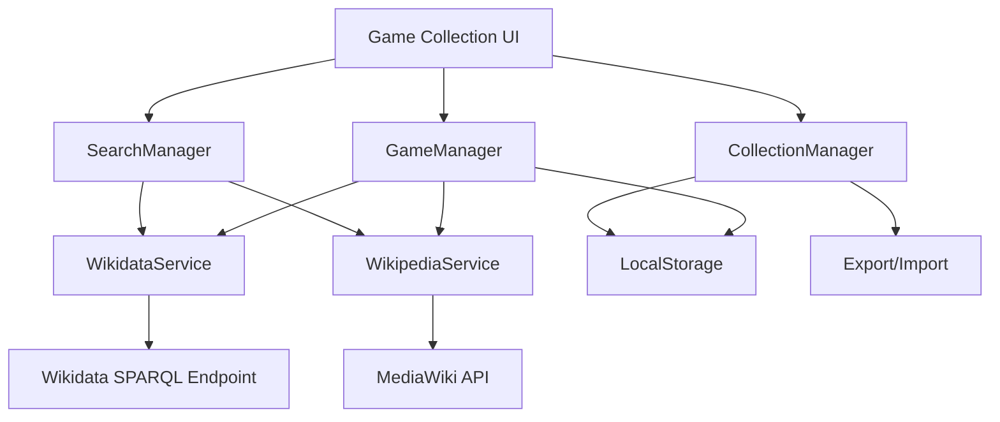
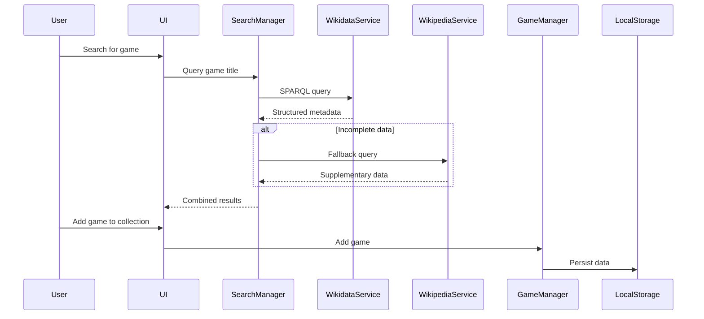

# Design Document

## Overview

This design document outlines the transformation of the existing Virtual Bookshelf application into a comprehensive Game Collection Management System. The application will maintain the core visual and interaction patterns of the original bookshelf while adapting the data model, API integrations, and user interface to support video game collections.

The system will implement a multi-tiered data acquisition strategy based on the Gemini research findings:
- **Tier 1**: Wikidata SPARQL queries for structured metadata
- **Tier 2**: Wikipedia MediaWiki API for supplementary information  
- **Tier 3**: Deep-linking to official stores for pricing (avoiding direct scraping)

## Architecture

### High-Level Architecture



### Data Flow Architecture



## Components and Interfaces

### Core Components

#### 1. GameManager (replaces BookManager)
**Purpose**: Manages CRUD operations for game collection data

**Key Methods**:
```javascript
class GameManager {
    async addGame(gameData)
    async updateGame(gameId, updates)
    async deleteGame(gameId)
    async getAllGames()
    async searchGames(query)
    async importGames(gameList)
    async exportCollection()
}
```

**Data Structure**:
```javascript
{
    id: "unique-game-id",
    title: "Game Title",
    platforms: ["PC", "PlayStation 5"],
    releaseDate: "2023-03-15",
    developer: "Developer Name",
    publisher: "Publisher Name",
    genre: ["Action", "Adventure"],
    coverImage: "https://...",
    description: "Game description",
    officialStoreLinks: {
        steam: "https://store.steampowered.com/...",
        playstation: "https://store.playstation.com/...",
        nintendo: "https://nintendo.com/..."
    },
    userMetadata: {
        rating: 5,
        notes: "Personal notes",
        completionStatus: "completed",
        dateAdded: "2024-01-15",
        tags: ["favorite", "multiplayer"]
    },
    dataSource: {
        primary: "wikidata",
        fallback: "wikipedia",
        attribution: "https://en.wikipedia.org/wiki/..."
    }
}
```

#### 2. WikidataService
**Purpose**: Handles queries to Wikidata SPARQL endpoint

**Key Methods**:
```javascript
class WikidataService {
    async searchGameByTitle(title)
    async getGameMetadata(wikidataId)
    buildSPARQLQuery(gameTitle)
    parseWikidataResponse(response)
}
```

**SPARQL Query Template**:
```sparql
SELECT ?game ?gameLabel ?releaseDate ?platformLabel ?developerLabel ?publisherLabel ?genreLabel ?image ?officialWebsite WHERE {
    ?game wdt:P31 wd:Q7889 .  # Instance of video game
    ?game rdfs:label "${gameTitle}"@en .
    
    OPTIONAL { ?game wdt:P577 ?releaseDate . }
    OPTIONAL { ?game wdt:P400 ?platform . }
    OPTIONAL { ?game wdt:P178 ?developer . }
    OPTIONAL { ?game wdt:P123 ?publisher . }
    OPTIONAL { ?game wdt:P136 ?genre . }
    OPTIONAL { ?game wdt:P18 ?image . }
    OPTIONAL { ?game wdt:P856 ?officialWebsite . }
    
    SERVICE wikibase:label { bd:serviceParam wikibase:language "ja,en" . }
}
```

#### 3. WikipediaService
**Purpose**: Fallback data source using MediaWiki API

**Key Methods**:
```javascript
class WikipediaService {
    async searchGamePage(title)
    async extractInfobox(pageContent)
    async getPageContent(pageTitle)
    parseInfoboxData(infoboxHtml)
}
```

#### 4. SearchManager
**Purpose**: Orchestrates multi-tiered search strategy

**Key Methods**:
```javascript
class SearchManager {
    async searchGame(title)
    async executeWikidataSearch(title)
    async executeFallbackSearch(title)
    mergeSearchResults(wikidataResult, wikipediaResult)
}
```

#### 5. CollectionManager (replaces existing collection logic)
**Purpose**: Manages user's game collections and organization

**Key Methods**:
```javascript
class CollectionManager {
    async createCollection(name, description)
    async addGameToCollection(gameId, collectionId)
    async removeGameFromCollection(gameId, collectionId)
    async getCollectionGames(collectionId)
    async updateCollectionOrder(collectionId, gameOrder)
}
```

### UI Components

#### 1. Game Search Interface
- Search input with autocomplete
- Search results display with game previews
- Add to collection buttons
- Data source attribution display

#### 2. Game Grid Display (adapted from book grid)
- Game cover art display
- Platform indicators
- User rating display
- Quick action buttons (view details, edit, remove)

#### 3. Game Detail Modal (adapted from book detail modal)
- Comprehensive game information
- Store link buttons (Steam, PlayStation, Nintendo, etc.)
- User notes and rating interface
- Collection management controls
- Data source attribution

#### 4. Collection Management Interface
- Collection creation/editing
- Game organization within collections
- Filtering and sorting options
- Export/import functionality

## Data Models

### Game Entity
```javascript
{
    // Core identifiers
    id: String,              // Internal unique ID
    wikidataId: String,      // Wikidata Q-number (if available)
    
    // Basic information
    title: String,
    alternativeTitles: Array,
    platforms: Array,        // ["PC", "PlayStation 5", "Nintendo Switch"]
    releaseDate: String,     // ISO date format
    
    // Development information
    developer: String,
    publisher: String,
    genre: Array,           // ["Action", "Adventure", "RPG"]
    
    // Media
    coverImage: String,     // URL to cover art
    screenshots: Array,     // Additional images
    
    // Content
    description: String,
    esrbRating: String,     // "E", "T", "M", etc.
    
    // Store links (deep-linking strategy)
    officialStoreLinks: {
        steam: String,
        playstation: String,
        nintendo: String,
        xbox: String,
        epic: String,
        gog: String
    },
    
    // User-specific data
    userMetadata: {
        rating: Number,         // 1-5 stars
        notes: String,
        completionStatus: String, // "not_started", "in_progress", "completed", "abandoned"
        dateAdded: String,
        playTime: Number,       // Hours played
        tags: Array,           // User-defined tags
        favorite: Boolean
    },
    
    // Data provenance
    dataSource: {
        primary: String,        // "wikidata", "wikipedia", "manual"
        fallback: String,       // Secondary source used
        attribution: String,    // Required for Wikipedia content
        lastUpdated: String
    }
}
```

### Collection Entity
```javascript
{
    id: String,
    name: String,
    emoji: String,          // Collection icon
    description: String,
    games: Array,           // Array of game IDs
    gameOrder: Array,       // Custom ordering of games
    createdDate: String,
    modifiedDate: String,
    settings: {
        sortBy: String,     // "title", "releaseDate", "dateAdded", "custom"
        sortDirection: String, // "asc", "desc"
        viewMode: String    // "grid", "list"
    }
}
```

### User Settings Entity
```javascript
{
    defaultView: String,        // "grid", "list"
    gamesPerPage: Number,
    coverSize: String,          // "small", "medium", "large"
    showPlatformIcons: Boolean,
    showRatings: Boolean,
    defaultCollection: String,  // Default collection ID
    dataAttribution: Boolean,   // Show data source attribution
    autoSave: Boolean,
    exportFormat: String        // "json", "csv"
}
```

## Error Handling

### Network Error Handling
```javascript
class NetworkErrorHandler {
    async handleWikidataError(error) {
        // Log error, attempt Wikipedia fallback
        console.warn('Wikidata query failed, attempting Wikipedia fallback');
        return await this.fallbackToWikipedia();
    }
    
    async handleWikipediaError(error) {
        // Log error, allow manual entry
        console.warn('Wikipedia query failed, enabling manual entry');
        return this.enableManualEntry();
    }
    
    handleImageLoadError(gameElement) {
        // Replace failed image with placeholder
        const img = gameElement.querySelector('.game-cover');
        img.src = this.getPlaceholderImage(gameElement.dataset.title);
    }
}
```

### Data Validation
```javascript
class DataValidator {
    validateGameData(gameData) {
        const required = ['title'];
        const missing = required.filter(field => !gameData[field]);
        
        if (missing.length > 0) {
            throw new ValidationError(`Missing required fields: ${missing.join(', ')}`);
        }
        
        return true;
    }
    
    sanitizeUserInput(input) {
        // Prevent XSS attacks
        return DOMPurify.sanitize(input);
    }
}
```

## Testing Strategy

### Unit Testing
- **GameManager**: CRUD operations, data validation
- **WikidataService**: SPARQL query construction, response parsing
- **WikipediaService**: InfoBox extraction, content parsing
- **SearchManager**: Multi-tier search orchestration
- **CollectionManager**: Collection operations, game organization

### Integration Testing
- **API Integration**: Wikidata and Wikipedia API responses
- **Data Flow**: End-to-end search and add game workflow
- **Storage**: LocalStorage persistence and retrieval
- **UI Integration**: Component interaction and state management

### User Acceptance Testing
- **Search Functionality**: Game discovery and metadata accuracy
- **Collection Management**: Creating, organizing, and managing collections
- **Data Attribution**: Proper licensing compliance display
- **Performance**: Response times for search and data loading
- **Offline Functionality**: Graceful degradation when APIs are unavailable

### Test Data Strategy
- **Mock Wikidata Responses**: Predefined SPARQL query results
- **Mock Wikipedia Content**: Sample InfoBox HTML structures
- **Edge Cases**: Games with missing data, network failures
- **Performance Testing**: Large collections (1000+ games)

## Implementation Phases

### Phase 1: Core Data Layer
1. Implement GameManager with basic CRUD operations
2. Create WikidataService with SPARQL query functionality
3. Implement WikipediaService for fallback data
4. Set up LocalStorage persistence layer

### Phase 2: Search and Discovery
1. Implement SearchManager with multi-tier strategy
2. Create game search UI components
3. Add search result display and selection
4. Implement data source attribution display

### Phase 3: Collection Management
1. Adapt existing bookshelf UI for games
2. Implement collection creation and management
3. Add game organization and sorting features
4. Create game detail modal with store links

### Phase 4: Enhanced Features
1. Add advanced filtering and search options
2. Implement export/import functionality
3. Add user preferences and settings
4. Optimize performance and add caching

### Phase 5: Polish and Testing
1. Comprehensive testing across all components
2. UI/UX refinements and accessibility improvements
3. Performance optimization
4. Documentation and deployment preparation